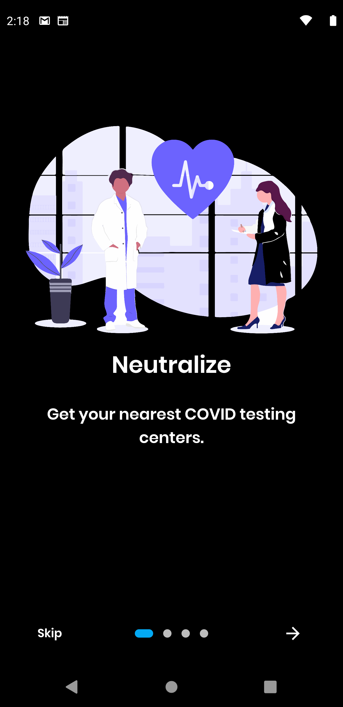
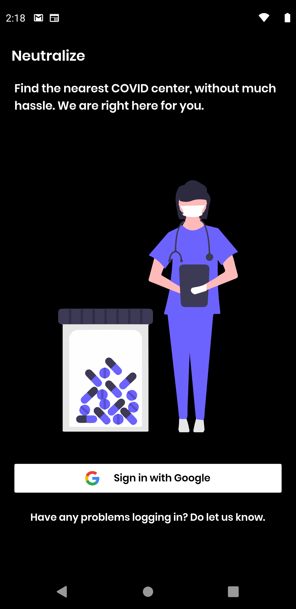
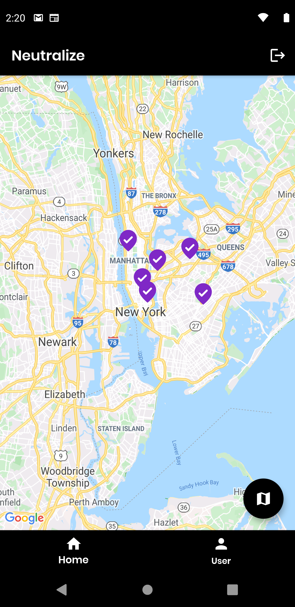
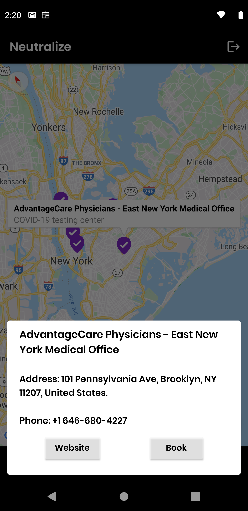
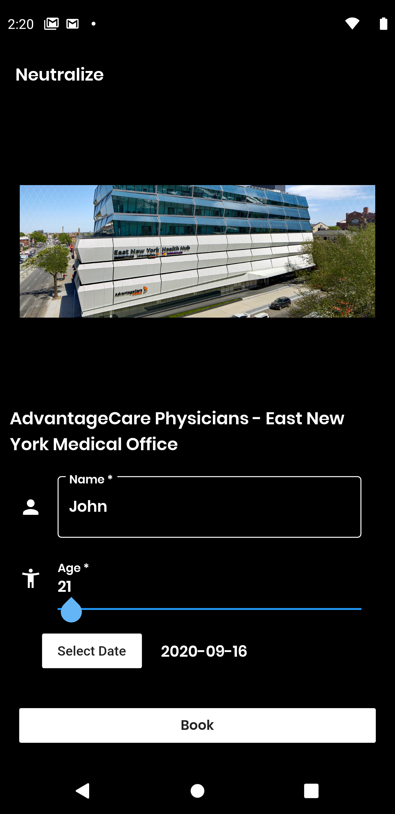
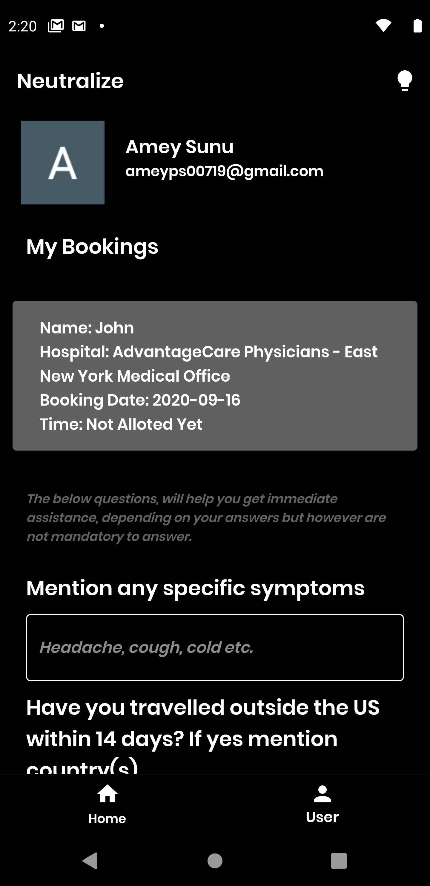
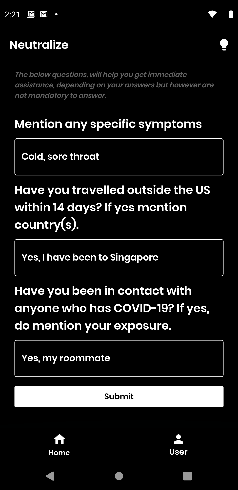
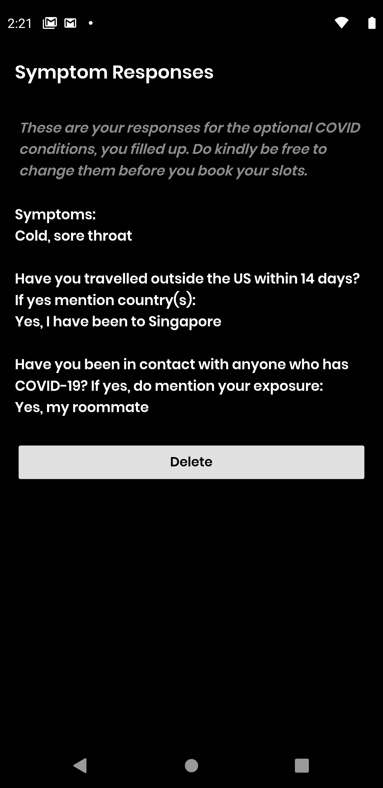

# Neutralize

Visit your nearest COVID centers, by booking an appointment so that you wouldn't have to stand in queues, which would help social distancing a lot and risk of exposure to the virus. Add your symptoms, if you have any so that the hospitals can come up with a sooner date and time slot depending on your symptom.

## Getting Started

This project is a starting point for a Flutter application.

A few resources to get you started if this is your first Flutter project:

- [Lab: Write your first Flutter app](https://flutter.dev/docs/get-started/codelab)
- [Cookbook: Useful Flutter samples](https://flutter.dev/docs/cookbook)

For help getting started with Flutter, view our
[online documentation](https://flutter.dev/docs), which offers tutorials,
samples, guidance on mobile development, and a full API reference.

## Features
  
 
  

  

  
## Run

```
flutter doctor
```
Make sure you have the requirements shown at the output, including XCode, Cocapods for iOS and macOS devices.

Navigate to project directory and run 
```
flutter clean
```
Open the project in Android Studio or VSCode and make sure you have Flutter pre-requisites needed for running the app, including the Dart and Flutter extension and manually run the files. For iOS devices, open the project in XCode and navigate to iOS files and open up Runner.xcproj and set up team and signing on XCode and run the program. 

Issues may occur while trying to run the app on XCode for iOS, hence follow the commands:

```
flutter clean
```
```
pod install
```
If no pods are found, continue to run the app on XCode.